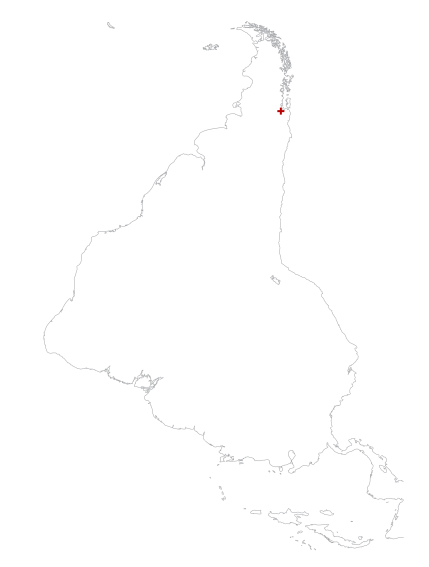

## Travesía Ralún, o del Ancho de América

> Ralún, Región de los Lagos. Recorrido: el ancho de América; San Antonio Oeste —Atlántico— Argentina, Bahía Mansa —Pacífico— Chile. 1er año de Arquitectura, a cargo de los profesores Patricio Cáraves, Jorge Ferrada, Esmeralda Rodríguez, Cristóbal Cox y Franco Marzal.

#### Experiencia Arquitectónica: Continuidad, levedad y proyección in situ
Balance Grupo Restauración

Dar cuenta desde el balance, es ciertamente partir desde término, desde haber dado cierre a un acto, a un emprender. Así, obedeciendo a esta realidad libremente elegida, para dar curso, tomo la carpeta-bitácora de travesía y, veo y leo el último croquis, hecho en estado de travesía:
Un dibujo de un arbusto poblado de flores, que da cuenta de la primavera. Flores de colores amarillos naranjas, saturados y más arriba el verde de hojas nacientes. Leo lo allí anotado:

*Un arbusto: un espino. 
solo, en un rincón, al fondo del terreno, junto al cerco que delimita la propiedad del Servicentro. 
Se abre a recibir, con las flores más espléndidas, abriendo un abanico de colores de los amarillos, rojos, a los verdes de ramaje superior. 
Éste, recibe con esplendor, en un retiro propio. 
Regocijo. Gozo. Hay algo de lo entero.[^1]*

Hacemos el balance, que es confrontación de activos con pasivos, para dar con la ubicación, para ubicarnos. La ubicación se da en lo entero. Y , lo entero cumplido. 

*dar  cumplimiento [^2]*

y agregamos: En el arte arquitectónico de amereida, lo entero cumplido mueve al regocijo, que es el acto con que se manifiesta la alegría de vivir.

Es desde esta alegría con júbilo, que desata gozo, retomo esta travesía nuestra.

Este intento es desde lo reciente a lo primero, es decir, desde el llegar al partir, porque es en este llegar que se abre el último paso del proyecto del Taller.

Hemos recorrido el ancho de América, en el paralelo 41º, latitud Sur.

Llegamos a Bahía Mansa , en el Océano Pacífico, costa de Osorno Chile, desde San Antonio Oeste, Río Negro, en el Océano Atlántico, Argentina.
Atravesamos pampas, sierras, lagos, cordilleras, 1.000 Km. en 24 hs. Con  5 momentos de nutrición, o casi comidas en cada bus.
Restauración, es el grupo del Taller encargado de alimentar al cuerpo del Taller esta vez, lo conformaron 72 personas. Siendo los días anteriores y posteriores de traslados y continuos al recorrido. 3 días.

Así, en el bus tuvimos hora de desayuno, 

* de snack, 
* de almuerzo, 
* de té, 
* de comida que hoy llaman cena.

Siendo un total de
Campamento:

* día 7 martes &rarr; 3 noviembre
* día 6 lunes &rarr; 2 noviembre
* día 5 domingo &rarr; 1 noviembre
* día 4 sábado &rarr; 31 octubre
* día 3 viernes &rarr; 30 octubre
* día 2 jueves &rarr; 29 octubre
* día 1 miércoles &rarr; 28 octubre
* día 0 martes &rarr;  27 octubre

Cada día de campamento el grupo de restauración, sirvió 5 comidas, como las antes mencionadas: desayuno, snack, almuerzo, té y comida; cuidando los menú en cantidad, temperatura, grado de cocción, higiene y presentación. Todo a la hora convenida. Con jornadas comenzando a las  06.00 hrs. y terminando alrededor de las 24.00 hrs. O incluso a las 00.30hs. lo constituían 9 personas:

* 2 alumnos del grupo de restauración
* 6 alumnos del resto de los otros grupos y,
* 1 señora, cocinera, manipuladora de alimentos de la Escuela de Ralún.

Cada uno provisto de guantes, mascarilla, y velo para la cabeza, desechables.

Contamos con 

* una cocina a leñas de 3 platos, 
* una cocina con 2 platos industriales a gas, 
* un espacio de cocina con lavamanos (casa parroquial),
* un comedor de 70 m2. Aproximados de los bomberos.

De  la Obra:
En el soto bosque de castaños, dentro del predio de la Escuela de Ralún, trazamos y conformamos 24 calzadas de tramos rectos, que le dan lugar al paso de los que pasan , de los que pasean, de los pasos – saltos de los niños. Y parapettos, cuatro detenciones donde coger y apreciar ese espacio; allí, ver.
Lo primero fue desbrozar y limpiar el bosque.  De este modo , el espacio abierto, el él nos dimos una jornada de observación y de acto. De ello surgieron las afirmaciones, que dieron paso a las huellas que fueron dibujado el terreno,lo que nos trajo suelo. De igual forma conformamos los parapettos: Aquellas detenciones, para albergar al cuerpo en pausa y, dar pie al paso del paseo. Siendo este el tamaño menor de la arquitectura. Aquí se encuentra la lección de este Taller, la que se hace cargo de conformar la continuidad, lo propio del espacio que construye la arquitectura. Calzadas y parapetto, que dan la forma de lo templado al bosque, construyendo un lugar para ir al encuentro. 

En la preparación, los viajes de pre travesía nos permitieron contar con el sitio posible y los materiales y herramientas para la construcción. 
Así, contamos con

* 6 mil adocretos, que en el obrar los llamamos “anacletos” de 12 x 7 x 7 cms.
* 10 tablas pino de 1 x 10''  cepilladas
* 10 rollizos pino impregnados 3.20 m.
* 5 cerchas de roble, tablas de 1 x 7'' de demolición.

La obra, la construimos en 7 jornadas de trabajo, participando en ella 60 alumnos y 7 profesores.

La travesía es la obra y el recorrido, atravesando el ancho de américa. Este término poético – arquitectónico de amereida, lo vivimos y padecimos y palpamos el ancho de américa, ese que dibujaran las leyes de Indias, para asignar tierras reales de mar a mar.

La lección arquitectónica, de la continuidad, con la asistencia a la travesía, se enriqueció con las siguientes realidades:

* La levedad Faena que sabe leer la realidad material , ser obediente creativamente a dicha realidad; con el objetivo de dar cumplimiento a la obra: Asi, dejarla entera que no completa.
Lo propio de una obra de travesía, que alcanza el tamaño arquitectónico y estatuto de obra, para ser regalada.
La levedad, lo leve es abierta invitación a otros. Otro que le sea urgente fijar lo trazado.
* El proyectar in situ. Faena de decidir , definir ahora y aquí, en el lugar mismo de la obra. Hecho a escala de obra, es decir 1:1. Lo que reclama decision y contar con “cuerpo en obra”.

Patricio Cáraves

####PLANOS DE CONVERGENCIA RELATIVOS A LA TRAVESÍA
Balance del grupo Ámbito de Taller

Esta vez la Travesía ha abierto un doble plano de tiempo que converge en la Obra por un lado; y en el Recorrido. Tomando desde amereida ...”hoy partimos a recorrer América”. Este doble plano de convergencia se logra a través de lo que podemos denominar los traslados, que permiten constituir la logística necesaria entre ambas convergencias, como asi también las instancias previas de la Travesía, los contactos, el previo conocimiento del lugar, las autoridades y los apoyos materiales como de gestión institucional, autorizaciones y materiales.

El Ámbito del Taller de Travesía sostiene entonces dimensiones externas y dimensiones internas a esos planos de convergencia, que llevan a implementar en la travesía un tiempo... e incluso en conjugación con los otras fracciones del Taller, un ritmo. Ese Ritmo va desde lo que podemos denominar de lo a la mano... que llega a establecer un orden de prontitud próxima al cuerpo, que lleva consigo la construcción de una identidad, que permite armar de forma concreta un primer orden de corporeidad grupal. Esto se llevó a cabo con la construcción de un bolso (banano de Travesía) cuyo sentido primario es poder contener lo próximo al cuerpo, lo necesario para el trabajo, la observación y la construcción, en una unidad. El bolso o banano, constituye una unidad indeformable con respecto al tiempo. Aquello que a la mano contiene un total.

Por otro lado, la fracción de Ámbito se ha ocupado del Registro. Una parte de este registro tiene que ver con el registro fotográfico y de video, y otra con el registro planimétrico de la Obra, abarcando con ambos modos, lo que hemos denominado los dos planos de convergencia de la Travesía.

Desde el video y la fotografía, se ha abordado un registro sistemático en torno a la designación de temas específicos: encargos estables para la captura de los distintos momentos, pero ceñidos a un guión fijo pre-señalado y a un protocolo preestablecido. Para el caso del registro planimétrico, se propuso constituir un registro permanente del sitio de la Obra y del Lugar, el cual cumplió un programa establecido de recopilar la información de modo sistemático para poder llegar a constituir una planimetría completa y precisa que permita a los encargados de la Ilustre Municipalidad de Puerto Varas continuar con la faena de consolidar el Lugar como espacio público permanente.

Durante la travesía, se permaneció tanto en los trayectos, detenciones o recorridos, con lecturas, algunos videos y actos que se realizaron junto al poeta Carlos Covarrubias.

Jorge Ferrada Herrera

####FIJAR EL ESTAR SITUADO Y SER ORIENTADOS EN COMÚN
Balance del grupo Campamento

Si la Travesía habla de salir a recorrer, el campamento ha de ser el punto de encuentro, lo más fijo, aquello que marca la referencia.
Estamos y así podemos realizar la obra.
Era nuestra labor aquel estar.
Debíamos ser conscientes de lo que implica hallarse in situ y esto tiene que ver con hallarse orientado. Es una necesidad intrínseca -así te ubicas- en el espacio, con personas, contigo mismo, sólo así uno se ‘’encuentra’’. Se halla in situ, se sitúa. Así es que nos compete en la arquitectura.
Saber dónde estoy parado, ‘’adaptarse o morir’’ dice Charles Darwin. En campamento actuamos para fijar este estar situado. Así, orientados en común, en obra.

Ser orientados es saber ‘’cual es el alba perpetua de tu origen’’. Nuestro origen: poético, el alba perpetua: atravesar el desconocido juntos.

Lo primero fue conocer las condiciones con las que contábamos: la información que Jorge Ferrada nos provee desde la avanzada y otras consideraciones basadas en su ubicación geográfica. La lluvia fue nuestra principal preocupación ¿cómo mantenernos con un descanso real bajo cualquier circunstancia? Vamos a destemplar el ensueño, no el cuerpo.

Jorge nos informa sobre la situación: tenemos a nuestra disposición la sede vecinal, la estación de bomberos, la casa del párroco, los baños y duchas de la escuela “Cristo Rey” fuera de horario de clases. En Ralún hay una cancha de fútbol, una posta, una capilla y un bosque donde se realizará la obra. Todo esto conforma un centro.
Teníamos una idea del lugar y en caso de emergencia la posibilidad de refugio, pero debíamos obrar por un campamento que fuese más que un refugio: convivencia, encuentro cotidiano, obrar y descansar. Debíamos procurar una forma.
Pensamos una gran carpa que nos alojase a todos bajo un mismo cielo, gesto de compartir el estar en común que se nos aproximaba. Resolvimos finalmente protegernos de la lluvia con cobertores plásticos para cada carpa, a partir de un sistema con estacas y vientos, en los que cada cual según su carpa y el método sugerido construyó un acceso.

Estar en común para el Taller del Primer Año, es distinto que para un Taller de Quinto. La primera acción fue elegir compañeros de carpa. Luego, estando allá, la utilización de los cobertores fue una coordenada que nos unificó ante quienes nos recibían (éramos un cuerpo uniforme de campamento) y organizado ante un pasillo en forma de “C”. Cada quiebre fue marcando un barrio o grupo. En este tiempo de permanencia, desde el encuentro, desde el verse día a día originó la vecindad, que nos acercó a la posibilidad de reconocernos.

Más avanzada la Travesía, el campamento debió trasladarse desde la cancha a los terrenos de la escuela. Estas tres vecindades se enfilaron armando nuevas relaciones, ahora el encuentro era también en el “a través” del entre carpas. Al estar estas en seguidilla una al lado de la otra, nos trajo un cambio de aire más condensado que coincidió con el tiempo más intenso de trabajo en la obra.

(del colofón de la bitácora de Travesía)
‘’La travesía es un tiempo (con otro tiempo) donde se vive desde el obrar, el estar en común, actuar en común, ser un cuerpo. Un cuerpo donde nuestro corazón se une en la obra, y en el obrar. Aquí crecemos. El tiempo lo rige el sol, la limpieza y el hambre. El avance por sobre todo es lo único que importa realmente.
Ir recorriendo con un rumbo donde la ruta es conocida, pero no sus horizontes, cielo y colores. Juntos nos empapamos de atravesar, de encontrar la extensión de América, de avanzar, juntos.’’

Esmeralda Rodríguez Melo

#### COTIDEANEIDAD DE FORMA PRESENTE
Balance del Grupo Herramientas

De Ralùn y el Ancho de América.
Se estructura el Taller para la Travesía. El trabajo entre varios se organiza en grupos cuyas tareas atienden distintos frentes para sostener nuestro recorrido y permanencia durante el tiempo de Travesía.

Los dos momentos inherentes a ella se resuelven; uno en la preparación, al cual llamamos pre Travesía, y otro en el cumplimiento de roles que significa estar a cargo de algo, asumir en cuerpo presente construyendo este tiempo distinto.

El grupo Herramientas se constituye con la participación de diez alumnos que se involucran con lucidez en una relación directa con la Obra. Esto se traduce en garantizar desde “acá” aquello que “allá” será necesario y de lo cual no podremos prescindir. De esta manera se registra en una bitácora grupal el inicio de un trabajo que va en consonancia con la economía. Entendemos esta economía como un manejo inteligente de recursos, conducente a no dejar sobrantes por sobre el gastar lo mínimo, donde sea la justeza aquello que guía el paso hasta quedar equipados. De las múltiples cotizaciones y solicitudes al Taller para el préstamo de herramientas, se completa el pañol en contacto con la municipalidad de Puerto Varas quienes no solamente ofrecen herramientas sino también una donación significativa de materiales que conformarán la Obra. Así es que se nos aparece el tema de la Entrega.

Partir de Travesía comprende una entrega, poner a disposición algo para la Obra y vida que se deben sostener durante esos días fuera de sede. Ante un requerimiento nacido de la realidad del lugar al que fuimos en Ralún, el grupo Herramientas se inscribe en el autoencargo de proyectar y construir un taburete desarmable para cada una de las 76 personas que componen al Taller de Primer año. Significó dar pasos en ronda hacia un trabajo formal y propuesta de color materializados en una experiencia constructiva: enfrentar el encargo hasta completarlo incluyendo no solo su construcción y pintado sino también embalaje y armado in situ. Luego se vuelve presente en la Travesía como elemento de la cotidianeidad del comedor y de la ocasión de algunos actos poéticos. 

Con esto palpamos lo que significa ser un alumno de arquitectura, iniciarse en un oficio que le da forma a las cosas, incluidas las cotidianas, y al espacio, un espacio para otro, que lo habitará. Esta iniciación parte del lenguaje, en palabras de Joseph Beuys:

> tan universal en el fondo que se puede decir que el lenguaje es el profesor. Es decir, en el momento en que hablo, yo soy de momento el profesor. Y en cuanto escucho, el alumno

Así una vez con el lenguaje, se nombra- y parte la construcción de la Obra-. Esto es en y para el Taller y la Travesía, trabajo que desde un cuerpo construido, quiere dejar a todos en común, esta vez desde un mismo asiento para cada uno. 

Cristóbal Cox Bordalí

### SOBRE LA DIMENSIÓN DEL VIAJE: RECORRIDO Y TRASLADOS
Balance del Grupo Ruta - atravesar el ancho de América desde la costa del Océano Atlántico hasta la costa del Océano Pacífico a la altura del paralelo 41°

*¿Qué es la ruta? Es sólo seguir partiendo siempre, es mantener el rumbo abierto.[^3]*

 
Comienzo esta nota con una cita para quedar enmarcado en una palabra y así referirme a dos “partidas” fundamentales que nos han correspondido dentro de la tarea de encaminar el rumbo de la Travesía.
 
La primera tiene relación con el “ir” y el “volver”. Sabemos que partimos desde la Escuela, desde Valparaíso. Aquí comenzamos a prepararnos y aquí tenemos que regresar, pero también tenemos otras detenciones que fueron determinando tiempos intermedios de la Travesía: en Ralún un tiempo de obra, en Choele Choel un tiempo de conmemorar, en Las Grutas un tiempo de comenzar a atravesar. A este poder “llegar a un punto” para desencadenar estos tiempos lo llamaremos el trasladarse.
 
La segunda partida en la Travesía es la que le da su completitud para transformarla en un viaje, ésta cobra un valor mayor al trasladarse y tiene que ver con lo que Amereida nombra como el recorrer: “es por eso que mañana partimos a recorrer América”. Más que del “tener que llegar” nos dice del hacia lo que vamos; sentido que sólo se puede dar con la voluntad del que tiene el ánimo y cuerpo dispuesto a ello. Para nosotros ese “recorrer” es el rumbo: vamos determinados a atravesar el continente a su ancho (bien podríamos decir uno de sus anchos).
   
¿Y por qué este ancho? Lo hacemos para tener una dimensión del continente y de sus orillas, para que desde ellas aparezca la construcción de nuestros bordes como Taller. Primer año de Arquitectura ahora un Taller que tiene el ancho de América y sus bordes, será quizás esto lo que de cuenta de nuestro perfil.
 
De la playa del balneario Las Grutas en Argentina a la puesta del sol en Bahía Mansa en Chile; del Atlántico al Pacífico, el trazado de un paralelo de 928 kilómetros que es atravesado en 24 horas y que para nosotros como grupo se lleva con el ánimo de quien permanece de vigía y en vigilia: con el cuidado y atención del ir guiando y registrando día y noche la ruta, y de quien se obliga a obviar el desgaste y cansancio del cuerpo.

----
 
Vuelvo a la cita inicial para preguntarme: ¿Y cómo mantener el rumbo siempre abierto?
 
Será que este recorrer trata de acceder en ese desconocido que, aunque ya planificado, se va dando en el encontrarse con el territorio que se nos va revelando en un acto sostenido mediante el dibujo y la palabra; acto llevado con un pulso continuo del ir sobre la marcha, a veces anticipando, a veces sobreponiéndose a lo que se nos va apareciendo, llamados a estar abiertos a siempre maravillarse con aquello en lo que estamos (presente o regalo), y en lo que nos espera más adelante: será esto primero la ruta misma y el paisaje. Algo de esa experiencia es lo que se puede ver recogido en nuestras bitácoras y láminas. 

[^1]: Nota: gozo;  Estando en obra, al término de la jornada, Gaudí, al ver que los obreros, mirando la torre primera, terminada en su altura, y no se van a sus casas, les pregunta y, le responde uno sin bajar la vista del cielo: gozo.
[^2]: [Amereida](http://wiki.ead.pucv.cl/index.php/Amereida)
[^3]: Bitácora de la Primera Travesías de Amereida, Nota 46.
